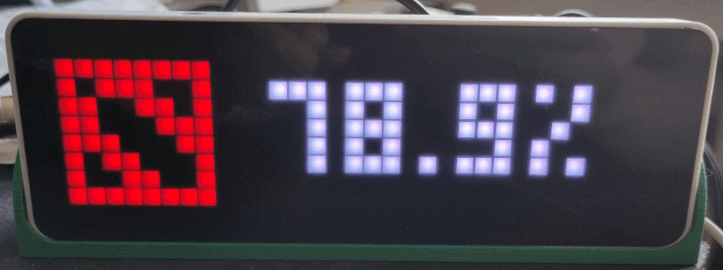

# License

pixelit.py and Pixelit Server
Copyright (C) 2023-2024

This program is free software: you can redistribute it and/or modify
it under the terms of the GNU General Public License as published by
the Free Software Foundation, either version 3 of the License, or
(at your option) any later version.

This program is distributed in the hope that it will be useful,
but WITHOUT ANY WARRANTY; without even the implied warranty of
MERCHANTABILITY or FITNESS FOR A PARTICULAR PURPOSE.  See the
GNU General Public License for more details.

You should have received a copy of the GNU General Public License
along with this program.  If not, see <http://www.gnu.org/licenses/>.


# pixelit.py and Pixelit Server


## What is PixelIt?

>The PixelIt is an ESP8266 / ESP32 (under construction) and WS2812B-LED based PixelArt display, controlled and fed via a JSON API. Settings and small tests are possible via the web interface, also a node-red node (node-red-contrib-pixelit) for the JSON API is available.
(Source: https://github.com/pixelit-project/PixelIt)

Besides of that, one can send text and bitmap messages via REST or MQTT to display on the led matrix. 


## What is pixelit.py?

`pixelit.py` is a python library aimed to support creating python scripts that send data to display on a pixelit led matrix via REST or MQTT. These scripts do not run on the ESP, but on a seperate machine, like a Raspberry Pi or another kind of server.

> :warning:  To use pixelit.py via mqtt you will need a mqtt broker (e.g. mosquitto) in your network. 

Imagine you have some python scripts like grabing news from an RSS feed, following you favorite artist's Toots on mastodon, showing the current weather or calulating your personal winrate in your favorite MOBA online game. You might want to display all this information on your led matrix. `pixelit.py` supports you encapsulating the logic from the api, so that you just need to call one `pixelit.py` function at the end of your custom script.

And hopefully you don't have do dig too deep into `pixelit.py`'s code since all important settings are easily accessible in a handy `config.py`.


### pixelit.py features

* Sending text & icons to your pixelit matrix 
* Handling mutliple PixelIt clients in sync
* Approximate display time for longer messages
* handling cache (e.g. you don't want to reach an API every single minute for the same result - save the data localy!)

#### Example Apps are:

* Simple Clock Display
* Current Weather Temperature
* Pi-Hole daily ads blocked
* RSS News Feed
* Dota2 Winrate Calculator
* Nightscout Bloodsugar Display
* tatort / Polizeiruf 110 Checker
* Messagequeue via CSV

### Setup pixelit.py via config.py

`config.py` is the central file to change settings according to your needs. `pixelit.py` and apps will use information saved in this file. To get started copy `config.example.py` to `config.py` and modify as needed.

```bash
cp config.example.py config.py
```

> :warning: Please enter one or more URLs of your pixelit controller to get started.


### Sending Text to Matrix

```python
sendText(
   text_msg="Hello World",
   red=255,
   green=255,
   blue=255,
   bigFont="false",
   scrollText="auto",
   centerText="false"
   )
```

| Parameter                 | Type             | Values                    | Description                       |
| ------------------------- | ---------------- | ------------------------- | --------------------------------- |
| `text_msg`                | String           |                           | Text to display on the led matrix |
| `red`, `green` and `blue` | Integer          | 0-255                     | values for text color             |
| `bigFont`                 | Boolean / String | "true" / "false"          | Alternates the font               |
| `scrollText`              | Boolean / String | "true" / "false" / "auto" | sets scrolling text               |
| `centerText`              | String           | "true" / "false"          | sets text to centered             |


For details please also consider https://pixelit-project.github.io/api.html#text.


### Sending Bitmap and Text to Matrix

 ```python
 sendApp(
   text_msg="Hello World",
   red=255,
   green=255,
   blue=255,
   icon="[255]",
   bigFont="false",
   scrollText='auto',
   centerText="false"
   )
 ```

This functions shares the same arguments as `sendText()` but also has the `icon` argument, which needs a bitmap description in braces as String.

| Parameter | Type   | Values                   | Description                  |
| --------- | ------ | ------------------------ | ---------------------------- |
| `icon`    | String | e.g. "[255,255,255,255]" | bitmap description in braces |

For details please also consider https://pixelit-project.github.io/api.html#text


### `sendNotification()` (not implemented yet)

 (Implementation tbd.)


### pixelItSleep(bool=True)

 You can switch off the display (not the controller/client!) via `pixelItSleep(True)`. This affects all pixelIt instances set up in `config.py`.

 To switch on again use `pixelItSleep(False)`.


### skipApp()

 `skipApp()` is used without agruments and tells the script to the display time of the current script to 0. For examples see [jellyfin-trackinfo-led.py](./jellyfin-trackinfo-led.py).

#### Example skipApp()

```python
if not currently_playing:
  print("[DEBUG] No device playing.")
  pixelit.skipApp()


```
### Calucalting timestamps

For that purpose `pixelit.py` provides `exceedsTimeLimit(appname,timeLimitMinutes)` method to save, load and check timestamp information. Internally objects are saved to a local dot-file using the `pickle` library.

As reference implementation see this commented example from `dota-led.py` usning both methods:

```python
  myappname="dota" # define an app name that will also be used for a file name for the timestamp and data cache.
  
  if pixelit.exceedsTimeLimit(myappname,60): 
    […]
```
The method checks for given app name and given minutes if a timelimit is exceeded in relation to the timestamp read from appname-timestamp.cache file. If not existing already the file will be created and considered as exceedsTimeLimit = true. The value for the minutes can be setup in the .config file and used as in `pixelit.exceedsTimeLimit(myappname,config.dota['fechtEveryMinutes'])`.


### Calucalting cache

You might want to save data from a script into a local cache file so you don't have to create it everytime the LED display shows information. This is especially helpful when gathering data from the internet (e.g. scraping websites or feeds) or having complex and timeconsuming calculations. You probably don't want this to be recalculated every couple for minutes.

For that purpose `pixelit.py` provides `writeDataToFile(data,appname)` and `readDataToFile(appname)` methods to save and load information. Internally objects are saved to a local dot-file using the `pickle` library.

As reference implementation see this commented example from `dota-led.py` usning both methods:

```python
  myappname="dota" # define an app name that will also be used for a file name for the timestamp and data cache.
  
  if pixelit.exceedsTimeLimit(myappname,config.dota['fechtEveryMinutes']): # if a certain time since the last calculation has passd
    data=calcWinrate(getOpenDotaData()) # then freshly caclulate the data 
    pixelit.writeDataToFile(data,myappname) # and write the fresh data to cache file
  else: #else means: we don't want do recalculate yet but load data from cache
    try:
      data=pixelit.readDataFromFile(myappname) #read data from cache
    except:
      data=calcWinrate(getOpenDotaData()) # if errors occure just calculate fresh data
      pixelit.writeDataToFile(data,myappname)
   showWinrate(data) # use the result either from cache or frehsly calculated
```


## What is Pixelit Server?

While the pixelit platform can only handle single calls via MQTT or REST, Pixelit Server collects multiple scripts and loops them, creating a constant varaity of information shown on your led matrix.

Therefore is dependent on functions defined in `pixelit.py`. While you can use `pixelit.py` on its own, the server always needs interaction with pixelit.py functions.

### Pixelit Server Features
* Display and cycle all configured python scripts ("Apps") using `pixelit.py`
* Have defined start and stop times for the display (=LEDs) defined in `config.py`

### How to setup Pixelit Server

> :warning: From 2024-04-02 on all apps need to be configured in `config.py`

1. In `config.py` setup the IPs to your hardware pixelit units. You might also want to adjust the text scroll speed via `scrollTextDelay` and use `minSecondsPerApp` to define a minimal time per app on the display. 
2. In `config.py` add all the names and paths (absolute paths recommended) to a list in the "apps" section. E.g.:
```
apps = {
  'clock' : './available-apps/clock-led.py',
  'app2'  : '/my/other/path/app2.py'
}
```
3. Start pixelit- server via `python3 pixelit-server.py` or create a [systemd service](./pixelit.service) for that. 
   * You might then start and stop this server via `systemctl start|stop|restart|status pixelit.service`.
   * Please adjust your path in the `.service` file.

> Read more about defining systemd scripts e.g. [here](https://www.baeldung.com/linux/systemd-create-user-services).

4. Be sure that all required python libraries are installed like `requests`, `pickle`, `threading`, `datetime` and `pytz`.  Depending on your apps you might also need `json`, `feedparser`, `random`, `bs4` and `urllib` and probably more for your own needs. A list of requierements can be found in the file `requirements.txt`. You can (or should) use a venv to manage python version and required modules.


> :warning: Remember to restart your server / service after adding or removing entries in the apps section of your `config.py`.


You can add as many apps in your `config.py`, as you want. You can also add the same app multiple times, but make sure to give them unique names (e.g. "clock1", "clock2") to have them mutiple times in your apploop.


### How to create and define apps?

To create and define apps for pixelit and pixelit server you should use functions from pixelit.py.

What is important here?
* When sending an app via `pixelit.sendApp()` it not only shows bitmap and text message, but also calculates the length of the message via `pixelit.calculateDisplayDuration()`.
* If a message is shorter than the configured `minSecondsPerApp` in `config.py`, then it waits for exactly this duration.
* If a massage is longer than the configured duration, it calculates the time depending on the length of the message.
* If you call an script in your but do not want anything to show, use `pixelit.skipApp()` to signalize skipping the char check and proceeding with the next app. This can be used to skip an app.


# Debugging

* When your message is interrupted by the internal clock display consider setting a higher value in your Pixelit web UI for clock auto fallback time 


# Changelog

* 2024-04-20: Adding start and stop times in config for pixelit-server.py
* 2024-04-02: Changed app discovery to config.py instead of having it in a defined directory structure.
* 2023-12-20: Changed file and directory structure to maintain a cleaner project. See "How to setup Pixelit Server" section.
